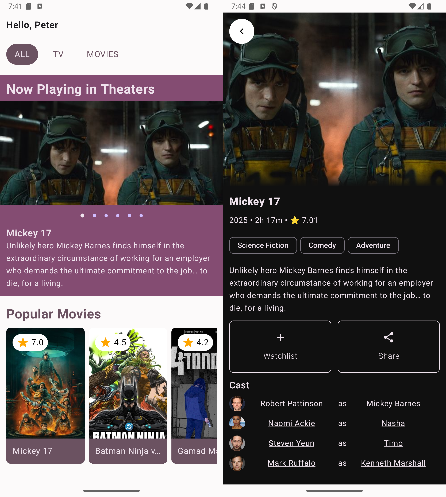

# VidBinge - Movie & TV Show Discovery App

VidBinge is a modern Android application built with Jetpack Compose, designed to help users discover and explore movies and TV shows. The app provides a seamless user experience with features like movie details, watchlist management, and more.

## Features

- **Home Screen**: Discover trending movies and TV shows with a beautiful carousel layout.
- **Movie Details**: Get detailed information about movies, including cast, genres, and ratings.
- **Watchlist**: Add movies to your watchlist for easy access later.
- **Responsive UI**: Built with Jetpack Compose for a modern and responsive user interface.
- **API Integration**: Fetches data from The Movie Database (TMDb) API to provide up-to-date information.

## Architecture

VidBinge follows the **Model-View-Intent (MVI)** architecture, which is a modern and reactive approach to building Android applications. Here's how the architecture is implemented:

### Key Components

1. **Model (State)**:
   - Represents the state of the UI at any given time.
   - Immutable data classes are used to define the state.
   - Example: `HomeScreenState`, `MovieDetailsScreenState`.

2. **View**:
   - Composable functions in Jetpack Compose represent the UI.
   - Observes the state and updates the UI accordingly.
   - Example: `HomeScreen`, `MovieDetailsScreen`.

3. **Intent**:
   - Represents user actions or events that trigger state changes.
   - Example: `HomeScreenIntent`, `MovieDetailsIntent`.

4. **ViewModel**:
   - Manages the state and handles intents.
   - Uses `BaseViewModel` and `SimpleBaseViewModel` to abstract common functionality.
   - Example: `HomeScreenViewModel`, `MovieDetailsViewModel`.

5. **Side Effects**:
   - Represents one-time events like navigation or showing a toast.
   - Example: `HomeScreenEffect`.

### Data Flow

1. **User Interaction**:
   - The user interacts with the UI, triggering an intent.
   - Example: Clicking a movie card triggers a `MovieClicked` intent.

2. **ViewModel Handling**:
   - The ViewModel receives the intent and updates the state accordingly.
   - Example: Fetching movie details when a `MovieClicked` intent is received.

3. **State Update**:
   - The ViewModel updates the state, and the UI recomposes to reflect the new state.
   - Example: Displaying movie details when the state is updated.

4. **Side Effects**:
   - If necessary, the ViewModel emits a side effect to handle one-time events.
   - Example: Navigating to the movie details screen.

### Abstraction Of State Management in `BaseViewModel` and `SimpleBaseViewModel`

The `BaseViewModel` and `SimpleBaseViewModel` classes are designed with several good coding practices in mind:

### 1. **Separation of Concerns**
- **`SimpleBaseViewModel`** handles the core state management logic, while **`BaseViewModel`** extends it to include side effects. This separation ensures that each class has a single responsibility.

### 2. **Immutable State**
- The state is exposed as an immutable `StateFlow`, ensuring that the UI can only observe the state and not modify it directly. This promotes a unidirectional data flow.

### 3. **Abstract Methods**
- **`initialState()`** and **`handleIntent()`** are abstract methods, forcing derived ViewModels to implement their own state initialization and intent handling logic. This ensures consistency across different ViewModels.

### 4. **State Updates**
- The **`updateState()`** method uses a reducer function to update the state immutably. This ensures that state changes are predictable and traceable.

### 5. **Side Effects**
- Side effects are managed using a **`MutableSharedFlow`**, which allows one-time events (like navigation or toasts) to be handled without being tied to the state. This prevents side effects from being re-triggered on state changes.

### 6. **Coroutine Scope**
- The ViewModel uses **`viewModelScope`** to launch coroutines, ensuring that coroutines are automatically canceled when the ViewModel is cleared. This prevents memory leaks.

### Example Code:

```kotlin
abstract class BaseViewModel<STATE : State, INTENT : Intent, SIDE_EFFECT : SideEffect> : SimpleBaseViewModel<STATE, INTENT>() {

    private var _screenEffects = MutableSharedFlow<SIDE_EFFECT>()
    val screenEffects: SharedFlow<SIDE_EFFECT> = _screenEffects.asSharedFlow()

    protected fun sendEffect(effect: SIDE_EFFECT) {
        viewModelScope.launch { _screenEffects.emit(effect) }
    }
}

abstract class SimpleBaseViewModel<STATE : State, INTENT : Intent> : ViewModel() {
    private var _screenState = MutableStateFlow(initialState())
    val screenState: StateFlow<STATE> = _screenState.asStateFlow()

    abstract fun initialState(): STATE
    abstract fun handleIntent(intent: INTENT)
    protected fun updateState(reducer: (STATE) -> STATE) {
        _screenState.update(reducer)
    }
}
```

## Technologies Used

- **Jetpack Compose**: For building the UI components.
- **Hilt**: For dependency injection.
- **Coil**: For image loading and caching.
- **Retrofit**: For network requests and API integration.
- **Kotlin Serialization**: For JSON serialization and deserialization.
- **Navigation Component**: For handling navigation between screens.

## Upcoming Features
VidBinge is continuously evolving, and several exciting features are planned for future updates to further enhance the user experience. Some of the upcoming features include:

### 1. **Tinder-Style Movie Selection**
A Tinder-style swipe interface will be introduced, allowing users to browse through movies and make preferences by swiping. Once both users have selected movies, the app will help decide what to watch based on mutual selections. This feature will utilize a local server running on one of the phones to sync data between devices, making it easy to connect with friends and choose a movie together.

### 2. **User Accounts and Watchlist Sync**
User accounts will be implemented, allowing for sign-ins, personalized profiles, and watchlist synchronization across multiple devices. This will ensure that a user's watchlist is always up-to-date and accessible, regardless of the device being used.

## Screenshots



## Contributing

Contributions are welcome! If you have any suggestions, bug reports, or feature requests, please open an issue or submit a pull request.

## License

This project is licensed under the MIT License - see the [LICENSE](LICENSE) file for details.

## Acknowledgments

- [The Movie Database (TMDb)](https://www.themoviedb.org/) for providing the API.
- Jetpack Compose documentation and community for guidance and support.

---

Feel free to explore the code and contribute to make VidBinge even better!
